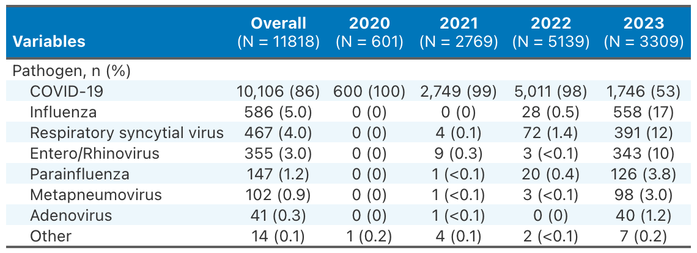

# **Methods**

### *Ethics and consent*

Human Research Ethics Committee (HREC) approval for data collection, with a waiver of informed consent, was granted via the National Mutual Acceptance (NMA) scheme, through the Alfred (HREC/16/Alfred/59), or by separate applications to individual sites. Research Governance approval was granted by the Chief Health Officer (CHO) in South Australia and Victoria, and supported by the CHO in Queensland, under legislated public health powers. Individual site Research Governance approvals were granted at all sites where it was required.

\

### *Participating centres*

Participating sites across Australia were identified following an expression of interest to ANZICS-CTG affiliated sites, or through previous affiliation with the SPRINT SARI AUS team. The ANZICS-CTG is a well-established research network with highly experienced research coordinators familiar with conducting high quality research studies. The initial case report form (CRF) had extensive development by local and international clinical experts, and includes standardized data fields that align with our international SPRINT-SARI collaborators.

\

### *Data collection*

Data in this report was entered by the research coordinator at the participating site. To support the rapid institution of data collection and reporting, SPRINT-SARI AUS hosts a data platform that includes an electronic data capture system, a secure repository and an analytic framework. Study data were collected and managed using REDCap electronic data capture tools hosted at Monash University[@harris2009, @harris2019].REDCap (Research Electronic Data Capture) is a secure, web-based software platform designed to support data capture for research studies, providing 1) an intuitive interface for validated data capture; 2) audit trails for tracking data manipulation and export procedures; 3) automated export procedures for seamless data downloads to common statistical packages; and 4) procedures for data integration and interoperability with external sources.

### *Dataset analysed*

Data in this report was extracted on 2024-05-22 at 10:18h and pertains to ICU admissions in Australia reported to the SPRINT-SARI AUS ICU COVID-19 database until 2023-12-31.

\

### *Statistical analysis*

Descriptive statistics have been reported as mean and standard deviation (SD) or median and interquartile range (IQR) and frequencies and percentages for categorical variables. Differences between groups were assessed using the chi-square test for categorical variables and the Wilcoxon rank sum test for continuous variables. Kaplan Meier survival estimates were used to describe the 30-day in-hospital mortality according to relevant groups of interest. All analyses were performed using R version 4.4.0 (R Core Team, 2023)[@rcoreteam2023] with pakages, "dplyr"[@wickham2023], "ggplot2" [@wickham2016], "ggpubr"[@kassambara2023], "forcats"[@wickham2023], "gtsummary"[@sjoberg2021], "gt"[@iannone2024], "survival"[@therneau2024]

\

### *Disclaimer*

This report is also descriptive and we urge caution in any inference particularly around causation.

The utmost effort has been made to ensure the highest quality data is being reported. However please note the following caveats:

-   The population in this report reflect the sickest patients with SARI patients being managed in contributing ICUs, and do not reflect the overall population of SARI patients.

-   Information is not complete for all patients.

-   Whenever possible, transfers were aggregated into one record.

\

# **Results**

## *Overall cohort*

```{r, echo=FALSE, message=FALSE, warning=FALSE}
library(dplyr)
library(tidyverse)
library(kableExtra)

data_ssari <- readRDS("cleaned_data/sprit_sari_annual_report_2023_dataset.rds")

data_ssari <- data_ssari %>% 
  filter(hostdat_icu <= "2023-12-31") 

data_baseline <- data_ssari %>% 
  group_by(subjid) %>%
  slice(1) %>%
  ungroup() %>%
  mutate(hosp_los = round(as.numeric(difftime(dsstdtc, hostdat, units = "days"))), 
         icu_los = round(as.numeric(difftime(dsstdtc_icudate, hostdat, units = "days"))))
```

\

#### Figure 1. Annual number of SARI cases

\

```{r echo=FALSE, fig.height=8, fig.width=10, message=FALSE, warning=FALSE}
library(ggpubr)
data_count <- data_baseline %>%
  mutate(icu_admission_month = paste0(format(hostdat_icu, "%Y"),"-"  , format(hostdat_icu, "%m"))) %>% 
  group_by(icu_admission_month) %>%
  summarise(n = n(), 
            year = format(hostdat_icu, "%Y")) %>%
  distinct() %>%
  group_by(year) %>%
  mutate(n_yearly = sum(n)) %>%
  arrange(icu_admission_month)

count <- data_count %>% select(year, n_yearly) %>% unique() %>% pull(n_yearly)
bars <- data_count %>% select(year, icu_admission_month) %>% group_by(year) %>% summarise(n_bars = n()) %>% pull(n_bars) %>% cumsum()

data_count %>%
  ggplot(aes(x = icu_admission_month, y = n, fill = year)) +
  geom_bar(stat = "identity") +
  scale_fill_viridis_d(option = "viridis", direction = 1) +
  annotate("rect", xmin = 0, xmax = bars[1]+.5, ymin = 0, ymax = count[1], fill = "#AF7AC5", alpha = 0.2) +
  annotate("rect", xmin = bars[1] +.5, xmax = bars[2]+.5, ymin = 0, ymax = count[2], fill = "#7FB3D5", alpha = 0.2) +
  annotate("rect", xmin = bars[2]+.5, xmax = bars[3]+.5, ymin = 0, ymax = count[3], fill = "#A9DFBF", alpha = 0.2) +
  annotate("rect", xmin = bars[3]+.5, xmax = bars[4]+.5, ymin = 0, ymax = count[4], fill = "#F9E79F", alpha = 0.2) +
  annotate("text", x = bars[1]/2, y = count[1], label = paste("n =", count[1]) , color = "#76448A", vjust = -.5) +
  annotate("text", x = sum(bars[1:2])/2, y = count[2], label = paste("n =", count[2]), color = "#2471A3", vjust = -.5) +
  annotate("text", x = sum(bars[2:3])/2, y = count[3], label = paste("n =", count[3]), color = "#1E8449", vjust = -.5) +
  annotate("text", x = sum(bars[3:4])/2, y = count[4], label = paste("n =", count[4]), color = "#D4AC0D", vjust = -.5) +
  theme_pubclean() + 
  theme(axis.text.x = element_text(angle = 90, hjust = 1)) +
  ylab("Number of SARI cases") +
  xlab("Month of ICU admission") +
  theme(legend.title = element_blank())
```

\

#### Figure 2. Pathogen proportion

\

```{r echo=FALSE, fig.width=10, message=FALSE, warning=FALSE}
library(forcats)

pathogen_data <- data_baseline %>%
  mutate(if_other_please_specify = tolower(if_other_please_specify)) %>%
  mutate(corona_ieorres = ifelse(grepl("covid", if_other_please_specify) | grepl("coronavirus", if_other_please_specify), 1, corona_ieorres),
         haemophilus = ifelse(grepl("haemophilus", if_other_please_specify), 1, 0),
         noncovid___1 = ifelse(grepl("influenza", if_other_please_specify), 1, noncovid___1),
         noncovid___2 = ifelse(grepl("flu", if_other_please_specify), 1, noncovid___2),
         noncovid___3 = ifelse(grepl("rsv", if_other_please_specify), 1, noncovid___3),
         noncovid___4 = ifelse(grepl("parainfluenza", if_other_please_specify), 1, noncovid___4),
         adenovirus = ifelse(grepl("adeno", if_other_please_specify), 1, 0),
         metapneumovirus = ifelse(grepl("metapneumovirus", if_other_please_specify) | 
                                    grepl("hmpv", if_other_please_specify)
                                  , 1, 0),
         entero_rhinovirus = ifelse(grepl("rhino", if_other_please_specify) | grepl("entero", if_other_please_specify), 1, 0),
         mycoplasma = ifelse(grepl("mycoplasma", if_other_please_specify), 1, 0),
  ) %>%
  mutate(pathogen = case_when(haemophilus == 1 ~ "Other",
                              corona_ieorres == 1 ~ "COVID-19",
                              noncovid___1 == 1 ~ "Influenza", 
                              noncovid___2 == 1 ~ "Influenza",
                              noncovid___3 == 1 ~ "Respiratory syncytial virus",
                              noncovid___4 == 1 ~ "Parainfluenza",
                              adenovirus == 1 ~ "Adenovirus",
                              metapneumovirus == 1 ~ "Metapneumovirus",
                              entero_rhinovirus == 1 ~ "Entero/Rhinovirus",
                              mycoplasma == 1 ~ "Other",
                              .default = "Other")) 

pathogen_data %>%
  select(pathogen) %>%
  group_by(pathogen) %>%
  summarise(prop = n()/nrow(data_baseline) * 100, 
            n = n()) %>%
  mutate(pathogen = fct_reorder(pathogen, prop)) %>%
  ggplot(aes(x = reorder(pathogen, prop), y = prop, fill = reorder(pathogen, prop))) +
  geom_bar(stat = "identity") +
  coord_flip() + 
  scale_fill_viridis_d(option = "rocket", direction = 1) + 
  theme_pubclean() + 
  theme(legend.position = "none") + 
  ylab("Proportion (%)") + 
  xlab("") + 
  geom_text(aes(label = paste0(round(prop, 1), "%, n = ", n)), hjust = -0.1) +
  ylim(0, 100) 
```

\

#### Figure 3. Pathogen proportion by year

\

```{r echo=FALSE, fig.height=8, fig.width=10, message=FALSE, warning=FALSE}

pathogen_data %>%
  mutate(icu_admission_month = paste0(format(hostdat_icu, "%Y"),"-"  , format(hostdat_icu, "%m")),
         year = format(hostdat_icu, "%Y")) %>% 
  group_by(year) %>%
  mutate(n_pop = n()) %>%
  group_by(pathogen, year) %>%
  summarise(n = n(), 
            prop = (n() / n_pop) * 100) %>%
  distinct() %>%
  ggplot(aes(x = year, y = prop)) +
  geom_bar(stat = "identity", aes(fill = reorder(pathogen, prop))) +
  scale_fill_viridis_d(option = "rocket", direction = 1) +
  theme_pubclean() +
  ylab("Proportion (%)") +
  xlab("Year of ICU admission") +
  theme(legend.title = element_blank())
```

\

#### Table 1. Pathogen proportion by year

\

```{r echo=FALSE, message=FALSE, warning=FALSE}
library(gtsummary)
library(gt)

reset_gtsummary_theme()
theme_gtsummary_journal(journal = 'nejm')
theme_gtsummary_compact()

pathogen_data %>% 
  mutate(year = format(hostdat_icu, "%Y")) %>%
  select(pathogen, year) %>%
  tbl_summary(by = year, 
              label = list(pathogen ~ "Pathogen, n (%)"), 
              statistic = list(all_categorical() ~ "{n} ({p})"), 
              sort = list(everything() ~ 'frequency')) %>% 
  add_overall() %>%
  modify_header(all_stat_cols() ~ md("**{level}**
  
                                     (N = {n})"),
                label = "**Variables**") %>% 
  modify_footnote(everything() ~ NA) %>% 
  as_gt() %>%
  tab_style(style = list(cell_text(weight = "bold")),
            locations = cells_group()) %>%
  opt_stylize(style = 6, color = "blue", add_row_striping = TRUE) %>%
  gtsave("tables/table_1.png")
```

```{r, echo=FALSE, message=FALSE, warning=FALSE, out.width="100%"}

```

\

#### Table 2. Baseline characteristics and treatments

\

```{r echo=FALSE, message=FALSE, warning=FALSE}
data_baseline %>%
  mutate(corona_ieorres = ifelse(is.na(corona_ieorres), 0, corona_ieorres)) %>% 
  mutate(corona_ieorres = ifelse(corona_ieorres == 1, "COVID-19", "Non-COVID-19")) %>%
  mutate(period = ifelse(hostdat_icu <= "2022-12-31", "2020-2022", "2023")) %>%
  mutate(chronic_liv_mhyn = case_when(mildliv_mhyn == 1 | modliver_mhyn == 1 ~ 1,
                                      is.na(mildliv_mhyn) & is.na(modliver_mhyn) ~ NA,
                                      .default = 0)) %>% 
  mutate(vasop_inot_sup = ifelse(period == "2023", NA, vasop_inot_sup)) %>%
  select(age_estimateyears, 
         sex, 
         bmi_calc, 
         obesity_mhyn,
         pregyn_rptestcd,
         apache_score,
         corona_ieorres,
         chroniccard_mhyn,
         obesity_mhyn,
         chronicpul_mhyn,
         diabetes_mhyn,
         diabetiscomp_mhyn,
         asthma_mhyn,
         renal_mhyn,
         rheumatology_mhyr,
         chronic_liv_mhyn,
         dementia_mhyn,
         malnutrition_mhyn,
         chronicneu_mhyn,
         malignantneo_mhyn,
         chronhaemo_mhyn,
         aidshiv_mhyn,
         chrimm_mhyn,
         imv_1,
         dura_vm1_reportonly,
         ecmo1,
         prone_pos,
         vasop_inot_sup,
         dialysis,
         period
  ) %>% 
  tbl_summary(by = period, 
              missing = "no",
              statistic = list(all_categorical() ~ "{n}/{N} ({p})"),
              label = list(age_estimateyears ~ "Age, years", 
                           sex ~ "Sex female", 
                           bmi_calc ~ "Body mass index, kg/m2",
                           obesity_mhyn ~ "Obesity",
                           pregyn_rptestcd ~ "Pregnancy",
                           apache_score ~ "APACHE II score",
                           corona_ieorres ~ "Infection type",
                           chroniccard_mhyn ~ "Chronic cardiac disease",
                           chronicpul_mhyn ~ "Chronic pulmonary disease",
                           diabetiscomp_mhyn ~ "Diabetes with complications",
                           diabetes_mhyn ~ "Diabetes",
                           asthma_mhyn ~ "Asthma",
                           renal_mhyn ~ "End stage kidney disease",
                           rheumatology_mhyr ~ "Rheumatological disease",
                           chronic_liv_mhyn ~ "Mild/Moderate liver disease",
                           dementia_mhyn ~ "Dementia",
                           malnutrition_mhyn ~ "Malnutrition",
                           chronicneu_mhyn ~ "Chronic neurological disease",
                           malignantneo_mhyn ~ "Malignant neoplasm",
                           chronhaemo_mhyn ~ "Chronic haematological disease",
                           aidshiv_mhyn ~ "HIV/AIDS",
                           chrimm_mhyn ~ "Chronic immunosuppression",
                           imv_1 ~ "Invasive mechanical ventilation",
                           ecmo1 ~ "ECMO",
                           prone_pos ~ "Prone positioning",
                           vasop_inot_sup ~ "Vasopressor or inotrope",
                           dialysis ~ "Renal replacement therapy", 
                           dura_vm1_reportonly ~ "Duration of invasive mechanical ventilation, days"),
              value = list(sex ~ 2)
  ) %>% 
  add_overall() %>%
  add_n() %>%
  modify_header(all_stat_cols() ~ md("**{level}**
    
                                       (N = {n})"),
                label = "**Variables**") %>% 
  modify_footnote(list(label ~ "Abbreviations: AIDS, Acquired Immunodeficiency Syndrome, APACHE II, Acute Physiology and Chronic Health Evaluation II; ECMO, Extra-Corporeal Membrane Oxygenation; HIV, Human Immunodeficiency Virus."), 
                  all_stat_cols() ~ "Continous variables are presented as median (IQR). Categorical variables are presented as n/N (%).") %>%   
  as_gt() %>% 
  tab_row_group(group = "Treatement in ICU", rows = 25:30) %>%
  tab_row_group(group = "Comborbidities", rows = 10:24) %>%
  tab_row_group(group = "Infection type and prognostic score", rows = 6:9) %>%
  tab_row_group(group = "Demographic", rows = 1:5) %>%
  tab_style(style = list(cell_text(weight = "bold")),
            locations = cells_group()) %>%
  opt_stylize(style = 6, color = "blue", add_row_striping = TRUE) %>% 
  opt_footnote_marks(marks = "extended") %>%
  gtsave("tables/table_2.png")
```

```{r, echo=FALSE, message=FALSE, warning=FALSE, out.width="100%"}

```


\

#### Table 3. Outcomes

\

```{r echo=FALSE, message=FALSE, warning=FALSE}
data_baseline %>%
  mutate(corona_ieorres = ifelse(is.na(corona_ieorres), 0, corona_ieorres)) %>% 
  mutate(corona_ieorres = ifelse(corona_ieorres == 1, "COVID-19", "Non-COVID-19")) %>%
  mutate(period = ifelse(hostdat_icu <= "2022-12-31", "2020-2022", "2023")) %>%
  select(
    icu_los,
    hosp_los,
    dsterm_2,
    dsterm,
    outcm_cod,
    period
  ) %>% 
  tbl_summary(by = period, 
              missing = "no",
              statistic = list(all_categorical() ~ "{n}/{N} ({p})"),
              label = list(icu_los ~ "ICU length of stay, days", 
                           hosp_los ~ "Hospital length of stay, days",
                           dsterm_2 ~ "ICU outcome",
                           dsterm ~ "Hospital outcome",
                           outcm_cod ~ "Cause of death")) %>% 
  add_overall() %>%
  add_n() %>%
  add_p() %>%
  modify_header(all_stat_cols() ~ md("**{level}**
                                       (N = {n})"),
                label = "**Variables**") %>%
  modify_footnote(list(all_stat_cols() ~ "Continous variables are presented as median (IQR). Categorical variables are presented as n/N (%).")) %>%   
  as_gt() %>% 
  opt_stylize(style = 6, color = "blue", add_row_striping = TRUE) %>% 
  opt_footnote_marks(marks = "extended") %>%
  gtsave("tables/table_3.png")
```

```{r, echo=FALSE, message=FALSE, warning=FALSE, out.width="100%"}

```

\

#### Figure 4. Kaplan Meier survival curves for 30-day in-hospital mortality according to the study period

\
```{r echo=FALSE, fig.height=8, fig.width=10, message=FALSE, warning=FALSE}
library(survival)
library(survminer)

data_cox <- data_baseline %>% 
  mutate(corona_ieorres = ifelse(is.na(corona_ieorres), 0, corona_ieorres)) %>% 
  mutate(corona_ieorres = ifelse(corona_ieorres == 1, "COVID-19", "Non-COVID-19")) %>%
  mutate(period = ifelse(hostdat_icu <= "2022-12-31", "2020-2022", "2023")) %>%
  mutate(died_hosp = case_when(is.na(dsterm) ~ NA,
                               dsterm == "Death" ~ 1,
                               .default = 0)) %>%
  mutate(died_fup30 = case_when(died_hosp == 0 ~ 30, 
                                died_hosp == 1 & hosp_los <= 30 ~ hosp_los,
                                died_hosp == 1 & hosp_los > 30 ~ 30)) %>%
  mutate(died_hosp_d30 = case_when(died_hosp == 1 & hosp_los <= 30 ~ 1,
                                   died_hosp == 1 & hosp_los > 30 ~ 0,
                                   died_hosp == 0 ~ 0)) 

dc_curve <- survfit(Surv(died_fup30, died_hosp_d30 == 1) ~ period, data = data_cox)

ggsurvplot(dc_curve, 
                     legend = "top", 
                     pval.method = TRUE, 
                     pval.method.coord = c(0,0.45), 
                     pval.coord = c(0,0.42), 
                     xlab  = "Time (day since ICU admission)", 
                     xlim = c(0,30),
                     ylim = c (0.4,1),
                     break.time.by = 5,
                     conf.int = TRUE, 
                     pval = TRUE, 
                     risk.table = TRUE,
                     linetype = 1,
                     tables.height = 0.3,
                     censor = FALSE, 
                     ylab = "Survival probability", 
                     legend.labs = c("2020-2022", "2023"),
                     legend.title = "",
                     ggtheme = theme_pubclean(), 
                     palette = c( "nejm"))
```

\

#### Figure 5. Kaplan Meier survival curves for 30-day in-hospital mortality in 2023 according to the infection type

\

```{r echo=FALSE, fig.height=8, fig.width=10, message=FALSE, warning=FALSE}
dc_curve <- survfit(Surv(died_fup30, died_hosp_d30 == 1) ~ corona_ieorres, data = data_cox %>% filter(period == "2023"))

ggsurvplot(dc_curve, 
                     legend = "top", 
                     pval.method = TRUE, 
                     pval.method.coord = c(0,0.45), 
                     pval.coord = c(0,0.42), 
                     xlab  = "Time (day since ICU admission)", 
                     xlim = c(0,30),
                     ylim = c (0.4,1),
                     break.time.by = 5,
                     conf.int = TRUE, 
                     pval = TRUE, 
                     risk.table = TRUE,
                     linetype = 1,
                     tables.height = 0.3,
                     censor = FALSE, 
                     ylab = "Survival probability", 
                     legend.labs = c("COVID-19", "Non-COVID-19"),
                     legend.title = "",
                     ggtheme = theme_pubclean(), 
                     palette = c( "nejm"))
```

## *Adults*

```{r, echo=FALSE, message=FALSE, warning=FALSE}
library(dplyr)
library(tidyverse)

data_ssari <- readRDS("cleaned_data/sprit_sari_annual_report_2023_dataset.rds")

data_ssari <- data_ssari %>% 
  filter(hostdat_icu <= "2023-12-31") %>%
  filter(age_estimateyears >= 18)

data_baseline <- data_ssari %>% 
  group_by(subjid) %>%
  slice(1) %>%
  ungroup() %>%
  mutate(hosp_los = round(as.numeric(difftime(dsstdtc, hostdat, units = "days"))), 
         icu_los = round(as.numeric(difftime(dsstdtc_icudate, hostdat, units = "days"))))
```

\
\

#### Figure 6. Annual number of SARI cases

\

```{r echo=FALSE, fig.height=8, fig.width=10, message=FALSE, warning=FALSE}
library(ggpubr)
data_count <- data_baseline %>%
  mutate(icu_admission_month = paste0(format(hostdat_icu, "%Y"),"-"  , format(hostdat_icu, "%m"))) %>% 
  group_by(icu_admission_month) %>%
  summarise(n = n(), 
            year = format(hostdat_icu, "%Y")) %>%
  distinct() %>%
  group_by(year) %>%
  mutate(n_yearly = sum(n)) %>%
  arrange(icu_admission_month)

count <- data_count %>% select(year, n_yearly) %>% unique() %>% pull(n_yearly)
bars <- data_count %>% select(year, icu_admission_month) %>% group_by(year) %>% summarise(n_bars = n()) %>% pull(n_bars) %>% cumsum()

data_count %>%
  ggplot(aes(x = icu_admission_month, y = n, fill = year)) +
  geom_bar(stat = "identity") +
  scale_fill_viridis_d(option = "viridis", direction = 1) +
  annotate("rect", xmin = 0, xmax = bars[1]+.5, ymin = 0, ymax = count[1], fill = "#AF7AC5", alpha = 0.2) +
  annotate("rect", xmin = bars[1] +.5, xmax = bars[2]+.5, ymin = 0, ymax = count[2], fill = "#7FB3D5", alpha = 0.2) +
  annotate("rect", xmin = bars[2]+.5, xmax = bars[3]+.5, ymin = 0, ymax = count[3], fill = "#A9DFBF", alpha = 0.2) +
  annotate("rect", xmin = bars[3]+.5, xmax = bars[4]+.5, ymin = 0, ymax = count[4], fill = "#F9E79F", alpha = 0.2) +
  annotate("text", x = bars[1]/2, y = count[1], label = paste("n =", count[1]) , color = "#76448A", vjust = -.5) +
  annotate("text", x = sum(bars[1:2])/2, y = count[2], label = paste("n =", count[2]), color = "#2471A3", vjust = -.5) +
  annotate("text", x = sum(bars[2:3])/2, y = count[3], label = paste("n =", count[3]), color = "#1E8449", vjust = -.5) +
  annotate("text", x = sum(bars[3:4])/2, y = count[4], label = paste("n =", count[4]), color = "#D4AC0D", vjust = -.5) +
  theme_pubclean() + 
  theme(axis.text.x = element_text(angle = 90, hjust = 1)) +
  ylab("Number of SARI cases") +
  xlab("Month of ICU admission") +
  theme(legend.title = element_blank())
```

\

#### Figure 7. Pathogen proportion

\

```{r echo=FALSE, fig.width=10, message=FALSE, warning=FALSE}
library(forcats)

pathogen_data <- data_baseline %>%
  mutate(if_other_please_specify = tolower(if_other_please_specify)) %>%
  mutate(corona_ieorres = ifelse(grepl("covid", if_other_please_specify) | grepl("coronavirus", if_other_please_specify), 1, corona_ieorres),
         haemophilus = ifelse(grepl("haemophilus", if_other_please_specify), 1, 0),
         noncovid___1 = ifelse(grepl("influenza", if_other_please_specify), 1, noncovid___1),
         noncovid___2 = ifelse(grepl("flu", if_other_please_specify), 1, noncovid___2),
         noncovid___3 = ifelse(grepl("rsv", if_other_please_specify), 1, noncovid___3),
         noncovid___4 = ifelse(grepl("parainfluenza", if_other_please_specify), 1, noncovid___4),
         adenovirus = ifelse(grepl("adeno", if_other_please_specify), 1, 0),
         metapneumovirus = ifelse(grepl("metapneumovirus", if_other_please_specify) | 
                                    grepl("hmpv", if_other_please_specify)
                                  , 1, 0),
         entero_rhinovirus = ifelse(grepl("rhino", if_other_please_specify) | grepl("entero", if_other_please_specify), 1, 0),
         mycoplasma = ifelse(grepl("mycoplasma", if_other_please_specify), 1, 0),
  ) %>%
  mutate(pathogen = case_when(haemophilus == 1 ~ "Other",
                              corona_ieorres == 1 ~ "COVID-19",
                              noncovid___1 == 1 ~ "Influenza", 
                              noncovid___2 == 1 ~ "Influenza",
                              noncovid___3 == 1 ~ "Respiratory syncytial virus",
                              noncovid___4 == 1 ~ "Parainfluenza",
                              adenovirus == 1 ~ "Adenovirus",
                              metapneumovirus == 1 ~ "Metapneumovirus",
                              entero_rhinovirus == 1 ~ "Entero/Rhinovirus",
                              mycoplasma == 1 ~ "Other",
                              .default = "Other")) 

pathogen_data %>%
  select(pathogen) %>%
  group_by(pathogen) %>%
  summarise(prop = n()/nrow(data_baseline) * 100, 
            n = n()) %>%
  mutate(pathogen = fct_reorder(pathogen, prop)) %>%
  ggplot(aes(x = reorder(pathogen, prop), y = prop, fill = reorder(pathogen, prop))) +
  geom_bar(stat = "identity") +
  coord_flip() + 
  scale_fill_viridis_d(option = "rocket", direction = 1) + 
  theme_pubclean() + 
  theme(legend.position = "none") + 
  ylab("Proportion (%)") + 
  xlab("") + 
  geom_text(aes(label = paste0(round(prop, 1), "%, n = ", n)), hjust = -0.1) +
  ylim(0, 100) 
```

\

#### Figure 8. Pathogen proportion by year

\

```{r echo=FALSE, fig.height=8, fig.width=10, message=FALSE, warning=FALSE}

pathogen_data %>%
  mutate(icu_admission_month = paste0(format(hostdat_icu, "%Y"),"-"  , format(hostdat_icu, "%m")),
         year = format(hostdat_icu, "%Y")) %>% 
  group_by(year) %>%
  mutate(n_pop = n()) %>%
  group_by(pathogen, year) %>%
  summarise(n = n(), 
            prop = (n() / n_pop) * 100) %>%
  distinct() %>%
  ggplot(aes(x = year, y = prop)) +
  geom_bar(stat = "identity", aes(fill = reorder(pathogen, prop))) +
  scale_fill_viridis_d(option = "rocket", direction = 1) +
  theme_pubclean() +
  ylab("Proportion (%)") +
  xlab("Year of ICU admission") +
  theme(legend.title = element_blank())
```

\

#### Table 4. Pathogen proportion by year

\

```{r echo=FALSE, message=FALSE, warning=FALSE}
library(gtsummary)
library(gt)

reset_gtsummary_theme()
theme_gtsummary_journal(journal = 'nejm')
theme_gtsummary_compact()

pathogen_data %>% 
  mutate(year = format(hostdat_icu, "%Y")) %>%
  select(pathogen, year) %>%
  tbl_summary(by = year, 
              label = list(pathogen ~ "Pathogen, n (%)"), 
              statistic = list(all_categorical() ~ "{n} ({p})"), 
              sort = list(everything() ~ 'frequency')) %>% 
  add_overall() %>%
  modify_header(all_stat_cols() ~ md("**{level}**
  
                                     (N = {n})"),
                label = "**Variables**") %>% 
  modify_footnote(everything() ~ NA) %>% 
  as_gt() %>% 
  tab_style(style = list(cell_text(weight = "bold")),
            locations = cells_group()) %>%
  opt_stylize(style = 6, color = "blue", add_row_striping = TRUE) %>%
  gtsave("tables/table_4.png")
```

```{r, echo=FALSE, message=FALSE, warning=FALSE, out.width="100%"}

```

\
\

#### Table 5. Baseline characteristics and treatments

\

```{r echo=FALSE, message=FALSE, warning=FALSE}
data_baseline %>%
  mutate(corona_ieorres = ifelse(is.na(corona_ieorres), 0, corona_ieorres)) %>% 
  mutate(corona_ieorres = ifelse(corona_ieorres == 1, "COVID-19", "Non-COVID-19")) %>%
  mutate(period = ifelse(hostdat_icu <= "2022-12-31", "2020-2022", "2023")) %>%
  mutate(chronic_liv_mhyn = case_when(mildliv_mhyn == 1 | modliver_mhyn == 1 ~ 1,
                                      is.na(mildliv_mhyn) & is.na(modliver_mhyn) ~ NA,
                                      .default = 0)) %>% 
  mutate(vasop_inot_sup = ifelse(period == "2023", NA, vasop_inot_sup)) %>%
  select(age_estimateyears, 
         sex, 
         bmi_calc, 
         obesity_mhyn,
         pregyn_rptestcd,
         apache_score,
         corona_ieorres,
         chroniccard_mhyn,
         obesity_mhyn,
         chronicpul_mhyn,
         diabetes_mhyn,
         diabetiscomp_mhyn,
         asthma_mhyn,
         renal_mhyn,
         rheumatology_mhyr,
         chronic_liv_mhyn,
         dementia_mhyn,
         malnutrition_mhyn,
         chronicneu_mhyn,
         malignantneo_mhyn,
         chronhaemo_mhyn,
         aidshiv_mhyn,
         chrimm_mhyn,
         imv_1,
         dura_vm1_reportonly,
         ecmo1,
         prone_pos,
         vasop_inot_sup,
         dialysis,
         period
  ) %>% 
  tbl_summary(by = period, 
              missing = "no",
              statistic = list(all_categorical() ~ "{n}/{N} ({p})"),
              label = list(age_estimateyears ~ "Age, years", 
                           sex ~ "Sex female", 
                           bmi_calc ~ "Body mass index, kg/m2",
                           obesity_mhyn ~ "Obesity",
                           pregyn_rptestcd ~ "Pregnancy",
                           apache_score ~ "APACHE II score",
                           corona_ieorres ~ "Infection type",
                           chroniccard_mhyn ~ "Chronic cardiac disease",
                           chronicpul_mhyn ~ "Chronic pulmonary disease",
                           diabetiscomp_mhyn ~ "Diabetes with complications",
                           diabetes_mhyn ~ "Diabetes",
                           asthma_mhyn ~ "Asthma",
                           renal_mhyn ~ "End stage kidney disease",
                           rheumatology_mhyr ~ "Rheumatological disease",
                           chronic_liv_mhyn ~ "Mild/Moderate liver disease",
                           dementia_mhyn ~ "Dementia",
                           malnutrition_mhyn ~ "Malnutrition",
                           chronicneu_mhyn ~ "Chronic neurological disease",
                           malignantneo_mhyn ~ "Malignant neoplasm",
                           chronhaemo_mhyn ~ "Chronic haematological disease",
                           aidshiv_mhyn ~ "HIV/AIDS",
                           chrimm_mhyn ~ "Chronic immunosuppression",
                           imv_1 ~ "Invasive mechanical ventilation",
                           ecmo1 ~ "ECMO",
                           prone_pos ~ "Prone positioning",
                           vasop_inot_sup ~ "Vasopressor or inotrope",
                           dialysis ~ "Renal replacement therapy", 
                           dura_vm1_reportonly ~ "Duration of invasive mechanical ventilation, days"),
              value = list(sex ~ 2)
  ) %>% 
  add_overall() %>%
  add_n() %>%
  modify_header(all_stat_cols() ~ md("**{level}**
    
                                       (N = {n})"),
                label = "**Variables**") %>% 
  modify_footnote(list(label ~ "Abbreviations: AIDS, Acquired Immunodeficiency Syndrome, APACHE II, Acute Physiology and Chronic Health Evaluation II; ECMO, Extra-Corporeal Membrane Oxygenation; HIV, Human Immunodeficiency Virus."), 
                  all_stat_cols() ~ "Continous variables are presented as median (IQR). Categorical variables are presented as n/N (%).") %>%   
  as_gt() %>% 
  tab_row_group(group = "Treatement in ICU", rows = 25:30) %>%
  tab_row_group(group = "Comborbidities", rows = 10:24) %>%
  tab_row_group(group = "Infection type and prognostic score", rows = 6:9) %>%
  tab_row_group(group = "Demographic", rows = 1:5) %>%
  tab_style(style = list(cell_text(weight = "bold")),
            locations = cells_group()) %>%
  opt_stylize(style = 6, color = "blue", add_row_striping = TRUE) %>% 
  opt_footnote_marks(marks = "extended") %>%
  gtsave("tables/table_5.png")
```

```{r, echo=FALSE, message=FALSE, warning=FALSE, out.width="100%"}

```

\

#### Table 6. Outcomes

\

```{r echo=FALSE, message=FALSE, warning=FALSE}
data_baseline %>%
  mutate(corona_ieorres = ifelse(is.na(corona_ieorres), 0, corona_ieorres)) %>% 
  mutate(corona_ieorres = ifelse(corona_ieorres == 1, "COVID-19", "Non-COVID-19")) %>%
  mutate(period = ifelse(hostdat_icu <= "2022-12-31", "2020-2022", "2023")) %>%
  select(
    icu_los,
    hosp_los,
    dsterm_2,
    dsterm,
    outcm_cod,
    period
  ) %>% 
  tbl_summary(by = period, 
              missing = "no",
              statistic = list(all_categorical() ~ "{n}/{N} ({p})"),
              label = list(icu_los ~ "ICU length of stay, days", 
                           hosp_los ~ "Hospital length of stay, days",
                           dsterm_2 ~ "ICU outcome",
                           dsterm ~ "Hospital outcome",
                           outcm_cod ~ "Cause of death")) %>% 
  add_overall() %>%
  add_n() %>%
  add_p() %>%
  modify_header(all_stat_cols() ~ md("**{level}**
    
                                       (N = {n})"),
                label = "**Variables**") %>%
  modify_footnote(list(all_stat_cols() ~ "Continous variables are presented as median (IQR). Categorical variables are presented as n/N (%).")) %>%   
  as_gt() %>% 
  opt_stylize(style = 6, color = "blue", add_row_striping = TRUE) %>% 
  opt_footnote_marks(marks = "extended") %>%
  gtsave("tables/table_6.png")
```

```{r, echo=FALSE, message=FALSE, warning=FALSE, out.width="100%"}

```

\

#### Figure 9. Kaplan Meier survival curves for 30-day in-hospital mortality according to the study period

\

```{r echo=FALSE, fig.height=8, fig.width=10, message=FALSE, warning=FALSE}
library(survival)
library(survminer)

data_cox <- data_baseline %>% 
  mutate(corona_ieorres = ifelse(is.na(corona_ieorres), 0, corona_ieorres)) %>% 
  mutate(corona_ieorres = ifelse(corona_ieorres == 1, "COVID-19", "Non-COVID-19")) %>%
  mutate(period = ifelse(hostdat_icu <= "2022-12-31", "2020-2022", "2023")) %>%
  mutate(died_hosp = case_when(is.na(dsterm) ~ NA,
                               dsterm == "Death" ~ 1,
                               .default = 0)) %>%
  mutate(died_fup30 = case_when(died_hosp == 0 ~ 30, 
                                died_hosp == 1 & hosp_los <= 30 ~ hosp_los,
                                died_hosp == 1 & hosp_los > 30 ~ 30)) %>%
  mutate(died_hosp_d30 = case_when(died_hosp == 1 & hosp_los <= 30 ~ 1,
                                   died_hosp == 1 & hosp_los > 30 ~ 0,
                                   died_hosp == 0 ~ 0)) 

dc_curve <- survfit(Surv(died_fup30, died_hosp_d30 == 1) ~ period, data = data_cox)

ggsurvplot(dc_curve, 
                     legend = "top", 
                     pval.method = TRUE, 
                     pval.method.coord = c(0,0.45), 
                     pval.coord = c(0,0.42), 
                     xlab  = "Time (day since ICU admission)", 
                     xlim = c(0,30),
                     ylim = c (0.4,1),
                     break.time.by = 5,
                     conf.int = TRUE, 
                     pval = TRUE, 
                     risk.table = TRUE,
                     linetype = 1,
                     tables.height = 0.3,
                     censor = FALSE, 
                     ylab = "Survival probability", 
                     legend.labs = c("2020-2022", "2023"),
                     legend.title = "",
                     ggtheme = theme_pubclean(), 
                     palette = c( "nejm"))
```

\

#### Figure 10. Kaplan Meier survival curves for 30-day in-hospital mortality in 2023 according to the infection type

\

```{r echo=FALSE, fig.height=8, fig.width=10, message=FALSE, warning=FALSE}
dc_curve <- survfit(Surv(died_fup30, died_hosp_d30 == 1) ~ corona_ieorres, data = data_cox %>% filter(period == "2023"))

ggsurvplot(dc_curve, 
                     legend = "top", 
                     pval.method = TRUE, 
                     pval.method.coord = c(0,0.45), 
                     pval.coord = c(0,0.42), 
                     xlab  = "Time (day since ICU admission)", 
                     xlim = c(0,30),
                     ylim = c (0.4,1),
                     break.time.by = 5,
                     conf.int = TRUE, 
                     pval = TRUE, 
                     risk.table = TRUE,
                     linetype = 1,
                     tables.height = 0.3,
                     censor = FALSE, 
                     ylab = "Survival probability", 
                     legend.labs = c("COVID-19", "Non-COVID-19"),
                     legend.title = "",
                     ggtheme = theme_pubclean(), 
                     palette = c( "nejm"))
```

## *Pediatric*

```{r, echo=FALSE, message=FALSE, warning=FALSE}
library(dplyr)
library(tidyverse)

data_ssari <- readRDS("cleaned_data/sprit_sari_annual_report_2023_dataset.rds")

data_ssari <- data_ssari %>% 
  filter(hostdat_icu <= "2023-12-31") %>%
  filter(age_estimateyears < 18)

data_baseline <- data_ssari %>% 
  group_by(subjid) %>%
  slice(1) %>%
  ungroup() %>%
  mutate(hosp_los = round(as.numeric(difftime(dsstdtc, hostdat, units = "days"))), 
         icu_los = round(as.numeric(difftime(dsstdtc_icudate, hostdat, units = "days"))))
```

\
\

#### Figure 11. Annual number of SARI cases

\

```{r echo=FALSE, fig.height=8, fig.width=10, message=FALSE, warning=FALSE}
library(ggpubr)
data_count <- data_baseline %>%
  mutate(icu_admission_month = paste0(format(hostdat_icu, "%Y"),"-"  , format(hostdat_icu, "%m"))) %>% 
  group_by(icu_admission_month) %>%
  summarise(n = n(), 
            year = format(hostdat_icu, "%Y")) %>%
  distinct() %>%
  group_by(year) %>%
  mutate(n_yearly = sum(n)) %>%
  arrange(icu_admission_month)

count <- data_count %>% select(year, n_yearly) %>% unique() %>% pull(n_yearly)
bars <- data_count %>% select(year, icu_admission_month) %>% group_by(year) %>% summarise(n_bars = n()) %>% pull(n_bars) %>% cumsum()

data_count %>%
  ggplot(aes(x = icu_admission_month, y = n, fill = year)) +
  geom_bar(stat = "identity") +
  scale_fill_viridis_d(option = "viridis", direction = 1) +
  annotate("rect", xmin = 0, xmax = bars[1]+.5, ymin = 0, ymax = count[1], fill = "#AF7AC5", alpha = 0.2) +
  annotate("rect", xmin = bars[1] +.5, xmax = bars[2]+.5, ymin = 0, ymax = count[2], fill = "#7FB3D5", alpha = 0.2) +
  annotate("rect", xmin = bars[2]+.5, xmax = bars[3]+.5, ymin = 0, ymax = count[3], fill = "#A9DFBF", alpha = 0.2) +
  annotate("rect", xmin = bars[3]+.5, xmax = bars[4]+.5, ymin = 0, ymax = count[4], fill = "#F9E79F", alpha = 0.2) +
  annotate("text", x = bars[1]/2, y = count[1], label = paste("n =", count[1]) , color = "#76448A", vjust = -.5) +
  annotate("text", x = sum(bars[1:2])/2, y = count[2], label = paste("n =", count[2]), color = "#2471A3", vjust = -.5) +
  annotate("text", x = sum(bars[2:3])/2, y = count[3], label = paste("n =", count[3]), color = "#1E8449", vjust = -.5) +
  annotate("text", x = sum(bars[3:4])/2, y = count[4], label = paste("n =", count[4]), color = "#D4AC0D", vjust = -.5) +
  theme_pubclean() + 
  theme(axis.text.x = element_text(angle = 90, hjust = 1)) +
  ylab("Number of SARI cases") +
  xlab("Month of ICU admission") +
  theme(legend.title = element_blank())
```

\

#### Figure 12. Pathogen proportion

\

```{r echo=FALSE, fig.width=10, message=FALSE, warning=FALSE}
library(forcats)

pathogen_data <- data_baseline %>%
  mutate(if_other_please_specify = tolower(if_other_please_specify)) %>%
  mutate(corona_ieorres = ifelse(grepl("covid", if_other_please_specify) | grepl("coronavirus", if_other_please_specify), 1, corona_ieorres),
         haemophilus = ifelse(grepl("haemophilus", if_other_please_specify), 1, 0),
         noncovid___1 = ifelse(grepl("influenza", if_other_please_specify), 1, noncovid___1),
         noncovid___2 = ifelse(grepl("flu", if_other_please_specify), 1, noncovid___2),
         noncovid___3 = ifelse(grepl("rsv", if_other_please_specify), 1, noncovid___3),
         noncovid___4 = ifelse(grepl("parainfluenza", if_other_please_specify), 1, noncovid___4),
         adenovirus = ifelse(grepl("adeno", if_other_please_specify), 1, 0),
         metapneumovirus = ifelse(grepl("metapneumovirus", if_other_please_specify) | 
                                    grepl("hmpv", if_other_please_specify)
                                  , 1, 0),
         entero_rhinovirus = ifelse(grepl("rhino", if_other_please_specify) | grepl("entero", if_other_please_specify), 1, 0),
         mycoplasma = ifelse(grepl("mycoplasma", if_other_please_specify), 1, 0),
  ) %>%
  mutate(pathogen = case_when(haemophilus == 1 ~ "Other",
                              corona_ieorres == 1 ~ "COVID-19",
                              noncovid___1 == 1 ~ "Influenza", 
                              noncovid___2 == 1 ~ "Influenza",
                              noncovid___3 == 1 ~ "Respiratory syncytial virus",
                              noncovid___4 == 1 ~ "Parainfluenza",
                              adenovirus == 1 ~ "Adenovirus",
                              metapneumovirus == 1 ~ "Metapneumovirus",
                              entero_rhinovirus == 1 ~ "Entero/Rhinovirus",
                              mycoplasma == 1 ~ "Other",
                              .default = "Other")) 

pathogen_data %>%
  select(pathogen) %>%
  group_by(pathogen) %>%
  summarise(prop = n()/nrow(data_baseline) * 100, 
            n = n()) %>%
  mutate(pathogen = fct_reorder(pathogen, prop)) %>%
  ggplot(aes(x = reorder(pathogen, prop), y = prop, fill = reorder(pathogen, prop))) +
  geom_bar(stat = "identity") +
  coord_flip() + 
  scale_fill_viridis_d(option = "rocket", direction = 1) + 
  theme_pubclean() + 
  theme(legend.position = "none") + 
  ylab("Proportion (%)") + 
  xlab("") + 
  geom_text(aes(label = paste0(round(prop, 1), "%, n = ", n)), hjust = -0.1) +
  ylim(0, 100) 
```

\

#### Figure 13. Pathogen proportion by year

\

```{r echo=FALSE, fig.height=8, fig.width=10, message=FALSE, warning=FALSE}

pathogen_data %>%
  mutate(icu_admission_month = paste0(format(hostdat_icu, "%Y"),"-"  , format(hostdat_icu, "%m")),
         year = format(hostdat_icu, "%Y")) %>% 
  group_by(year) %>%
  mutate(n_pop = n()) %>%
  group_by(pathogen, year) %>%
  summarise(n = n(), 
            prop = (n() / n_pop) * 100) %>%
  distinct() %>%
  ggplot(aes(x = year, y = prop)) +
  geom_bar(stat = "identity", aes(fill = reorder(pathogen, prop))) +
  scale_fill_viridis_d(option = "rocket", direction = 1) +
  theme_pubclean() +
  ylab("Proportion (%)") +
  xlab("Year of ICU admission") +
  theme(legend.title = element_blank())
```

\

#### Table 7. Pathogen proportion by year

\

```{r echo=FALSE, message=FALSE, warning=FALSE}
library(gtsummary)
library(gt)

reset_gtsummary_theme()
theme_gtsummary_journal(journal = 'nejm')
theme_gtsummary_compact()

pathogen_data %>% 
  mutate(year = format(hostdat_icu, "%Y")) %>%
  select(pathogen, year) %>%
  tbl_summary(by = year, 
              label = list(pathogen ~ "Pathogen, n (%)"), 
              statistic = list(all_categorical() ~ "{n} ({p})"), 
              sort = list(everything() ~ 'frequency')) %>% 
  add_overall() %>%
  modify_header(all_stat_cols() ~ md("**{level}**
  
                                     (N = {n})"),
                label = "**Variables**") %>% 
  modify_footnote(everything() ~ NA) %>% 
  as_gt() %>% 
  tab_style(style = list(cell_text(weight = "bold")),
            locations = cells_group()) %>%
  opt_stylize(style = 6, color = "blue", add_row_striping = TRUE) %>%
  gtsave("tables/table_7.png")
```

```{r, echo=FALSE, message=FALSE, warning=FALSE, out.width="100%"}

```

\
\

#### Table 8. Baseline characteristics and treatments

\

```{r echo=FALSE, message=FALSE, warning=FALSE}
data_baseline %>%
  mutate(corona_ieorres = ifelse(is.na(corona_ieorres), 0, corona_ieorres)) %>% 
  mutate(corona_ieorres = ifelse(corona_ieorres == 1, "COVID-19", "Non-COVID-19")) %>%
  mutate(period = ifelse(hostdat_icu <= "2022-12-31", "2020-2022", "2023")) %>%
  mutate(chronic_liv_mhyn = case_when(mildliv_mhyn == 1 | modliver_mhyn == 1 ~ 1,
                                      is.na(mildliv_mhyn) & is.na(modliver_mhyn) ~ NA,
                                      .default = 0)) %>% 
  mutate(vasop_inot_sup = ifelse(period == "2023", NA, vasop_inot_sup)) %>%
  select(age_estimateyears, 
         sex, 
         bmi_calc, 
         obesity_mhyn,
         pregyn_rptestcd,
         apache_score,
         corona_ieorres,
         chroniccard_mhyn,
         obesity_mhyn,
         chronicpul_mhyn,
         diabetes_mhyn,
         diabetiscomp_mhyn,
         asthma_mhyn,
         renal_mhyn,
         rheumatology_mhyr,
         chronic_liv_mhyn,
         dementia_mhyn,
         malnutrition_mhyn,
         chronicneu_mhyn,
         malignantneo_mhyn,
         chronhaemo_mhyn,
         aidshiv_mhyn,
         chrimm_mhyn,
         imv_1,
         dura_vm1_reportonly,
         ecmo1,
         prone_pos,
         vasop_inot_sup,
         dialysis,
         period
  ) %>% 
  tbl_summary(by = period, 
              missing = "no",
              statistic = list(all_categorical() ~ "{n}/{N} ({p})"),
              label = list(age_estimateyears ~ "Age, years", 
                           sex ~ "Sex female", 
                           bmi_calc ~ "Body mass index, kg/m2",
                           obesity_mhyn ~ "Obesity",
                           pregyn_rptestcd ~ "Pregnancy",
                           apache_score ~ "APACHE II score",
                           corona_ieorres ~ "Infection type",
                           chroniccard_mhyn ~ "Chronic cardiac disease",
                           chronicpul_mhyn ~ "Chronic pulmonary disease",
                           diabetiscomp_mhyn ~ "Diabetes with complications",
                           diabetes_mhyn ~ "Diabetes",
                           asthma_mhyn ~ "Asthma",
                           renal_mhyn ~ "End stage kidney disease",
                           rheumatology_mhyr ~ "Rheumatological disease",
                           chronic_liv_mhyn ~ "Mild/Moderate liver disease",
                           dementia_mhyn ~ "Dementia",
                           malnutrition_mhyn ~ "Malnutrition",
                           chronicneu_mhyn ~ "Chronic neurological disease",
                           malignantneo_mhyn ~ "Malignant neoplasm",
                           chronhaemo_mhyn ~ "Chronic haematological disease",
                           aidshiv_mhyn ~ "HIV/AIDS",
                           chrimm_mhyn ~ "Chronic immunosuppression",
                           imv_1 ~ "Invasive mechanical ventilation",
                           ecmo1 ~ "ECMO",
                           prone_pos ~ "Prone positioning",
                           vasop_inot_sup ~ "Vasopressor or inotrope",
                           dialysis ~ "Renal replacement therapy", 
                           dura_vm1_reportonly ~ "Duration of invasive mechanical ventilation, days"),
              value = list(sex ~ 2)
  ) %>% 
  add_overall() %>%
  add_n() %>%
  modify_header(all_stat_cols() ~ md("**{level}**
    
                                       (N = {n})"),
                label = "**Variables**") %>% 
  modify_footnote(list(label ~ "Abbreviations: AIDS, Acquired Immunodeficiency Syndrome, APACHE II, Acute Physiology and Chronic Health Evaluation II; ECMO, Extra-Corporeal Membrane Oxygenation; HIV, Human Immunodeficiency Virus."), 
                  all_stat_cols() ~ "Continous variables are presented as median (IQR). Categorical variables are presented as n/N (%).") %>%   
  as_gt() %>% 
  tab_row_group(group = "Treatement in ICU", rows = 25:30) %>%
  tab_row_group(group = "Comborbidities", rows = 10:24) %>%
  tab_row_group(group = "Infection type and prognostic score", rows = 6:9) %>%
  tab_row_group(group = "Demographic", rows = 1:5) %>%
  tab_style(style = list(cell_text(weight = "bold")),
            locations = cells_group()) %>%
  opt_stylize(style = 6, color = "blue", add_row_striping = TRUE) %>% 
  opt_footnote_marks(marks = "extended") %>%
  gtsave("tables/table_8.png")
```

```{r, echo=FALSE, message=FALSE, warning=FALSE, out.width="100%"}

```

\

#### Table 9. Outcomes

\

```{r echo=FALSE, message=FALSE, warning=FALSE}
data_baseline %>%
  mutate(corona_ieorres = ifelse(is.na(corona_ieorres), 0, corona_ieorres)) %>% 
  mutate(corona_ieorres = ifelse(corona_ieorres == 1, "COVID-19", "Non-COVID-19")) %>%
  mutate(period = ifelse(hostdat_icu <= "2022-12-31", "2020-2022", "2023")) %>%
  select(
    icu_los,
    hosp_los,
    dsterm_2,
    dsterm,
    outcm_cod,
    period
  ) %>% 
  tbl_summary(by = period, 
              missing = "no",
              statistic = list(all_categorical() ~ "{n}/{N} ({p})"),
              label = list(icu_los ~ "ICU length of stay, days", 
                           hosp_los ~ "Hospital length of stay, days",
                           dsterm_2 ~ "ICU outcome",
                           dsterm ~ "Hospital outcome",
                           outcm_cod ~ "Cause of death")) %>% 
  add_overall() %>%
  add_n() %>%
  add_p() %>%
  modify_header(all_stat_cols() ~ md("**{level}**
    
                                       (N = {n})"),
                label = "**Variables**") %>%
  modify_footnote(list(all_stat_cols() ~ "Continous variables are presented as median (IQR). Categorical variables are presented as n/N (%).")) %>%   
  as_gt() %>% 
  opt_stylize(style = 6, color = "blue", add_row_striping = TRUE) %>% 
  opt_footnote_marks(marks = "extended") %>%
  gtsave("tables/table_4.png")
```

```{r, echo=FALSE, message=FALSE, warning=FALSE, out.width="100%"}

```

\

#### Figure 14. Kaplan Meier survival curves for 30-day in-hospital mortality according to the study period

\

```{r echo=FALSE, fig.height=8, fig.width=10, message=FALSE, warning=FALSE}
library(survival)
library(survminer)

data_cox <- data_baseline %>% 
  mutate(corona_ieorres = ifelse(is.na(corona_ieorres), 0, corona_ieorres)) %>% 
  mutate(corona_ieorres = ifelse(corona_ieorres == 1, "COVID-19", "Non-COVID-19")) %>%
  mutate(period = ifelse(hostdat_icu <= "2022-12-31", "2020-2022", "2023")) %>%
  mutate(died_hosp = case_when(is.na(dsterm) ~ NA,
                               dsterm == "Death" ~ 1,
                               .default = 0)) %>%
  mutate(died_fup30 = case_when(died_hosp == 0 ~ 30, 
                                died_hosp == 1 & hosp_los <= 30 ~ hosp_los,
                                died_hosp == 1 & hosp_los > 30 ~ 30)) %>%
  mutate(died_hosp_d30 = case_when(died_hosp == 1 & hosp_los <= 30 ~ 1,
                                   died_hosp == 1 & hosp_los > 30 ~ 0,
                                   died_hosp == 0 ~ 0)) 

dc_curve <- survfit(Surv(died_fup30, died_hosp_d30 == 1) ~ period, data = data_cox)

ggsurvplot(dc_curve, 
                     legend = "top", 
                     pval.method = TRUE, 
                     pval.method.coord = c(0,0.45), 
                     pval.coord = c(0,0.42), 
                     xlab  = "Time (day since ICU admission)", 
                     xlim = c(0,30),
                     ylim = c (0.4,1),
                     break.time.by = 5,
                     conf.int = TRUE, 
                     pval = TRUE, 
                     risk.table = TRUE,
                     linetype = 1,
                     tables.height = 0.3,
                     censor = FALSE, 
                     ylab = "Survival probability", 
                     legend.labs = c("2020-2022", "2023"),
                     legend.title = "",
                     ggtheme = theme_pubclean(), 
                     palette = c( "nejm"))
```

\

#### Figure 15. Kaplan Meier survival curves for 30-day in-hospital mortality in 2023 according to the infection type

\

```{r echo=FALSE, fig.height=8, fig.width=10, message=FALSE, warning=FALSE}
dc_curve <- survfit(Surv(died_fup30, died_hosp_d30 == 1) ~ corona_ieorres, data = data_cox %>% filter(period == "2023"))

ggsurvplot(dc_curve, 
                     legend = "top", 
                     pval.method = TRUE, 
                     pval.method.coord = c(0,0.45), 
                     pval.coord = c(0,0.42), 
                     xlab  = "Time (day since ICU admission)", 
                     xlim = c(0,30),
                     ylim = c (0.4,1),
                     break.time.by = 5,
                     conf.int = TRUE, 
                     pval = TRUE, 
                     risk.table = TRUE,
                     linetype = 1,
                     tables.height = 0.3,
                     censor = FALSE, 
                     ylab = "Survival probability", 
                     legend.labs = c("COVID-19", "Non-COVID-19"),
                     legend.title = "",
                     ggtheme = theme_pubclean(), 
                     palette = c( "nejm"))
```

# **Acknowledgements**

## *Participating sites*

```{r, echo=FALSE, message=FALSE, warning=FALSE}
library(readxl)
library(gt)
library(dplyr)

data <- read_excel("cleaned_data/acknowledgments.xlsx")

```

```{r, echo=FALSE, message=FALSE, warning=FALSE}
data %>% 
  select(state, 
         centre) %>% 
  rename("State" = state,
         "Centre" = centre) %>%
  gt() %>% 
  opt_stylize(style = 6, color = "gray", add_row_striping = TRUE)
```

## *Management Committee*

```{r, echo=FALSE, message=FALSE, warning=FALSE}
data %>% 
  select(managment) %>% 
  rename("Team" = managment) %>%
  na.omit() %>%
  gt() %>% 
  opt_stylize(style = 6, color = "gray", add_row_striping = TRUE)
```

\

## *Statistical analysis and reporting team*

```{r echo=FALSE, fig.width=10, message=FALSE, warning=FALSE, paged.print=TRUE}
data %>% 
  select(stats) %>% 
  rename("Team" = stats) %>%
  na.omit() %>%
  gt() %>% 
  opt_stylize(style = 6, color = "gray", add_row_striping = TRUE)
```

# **References**
