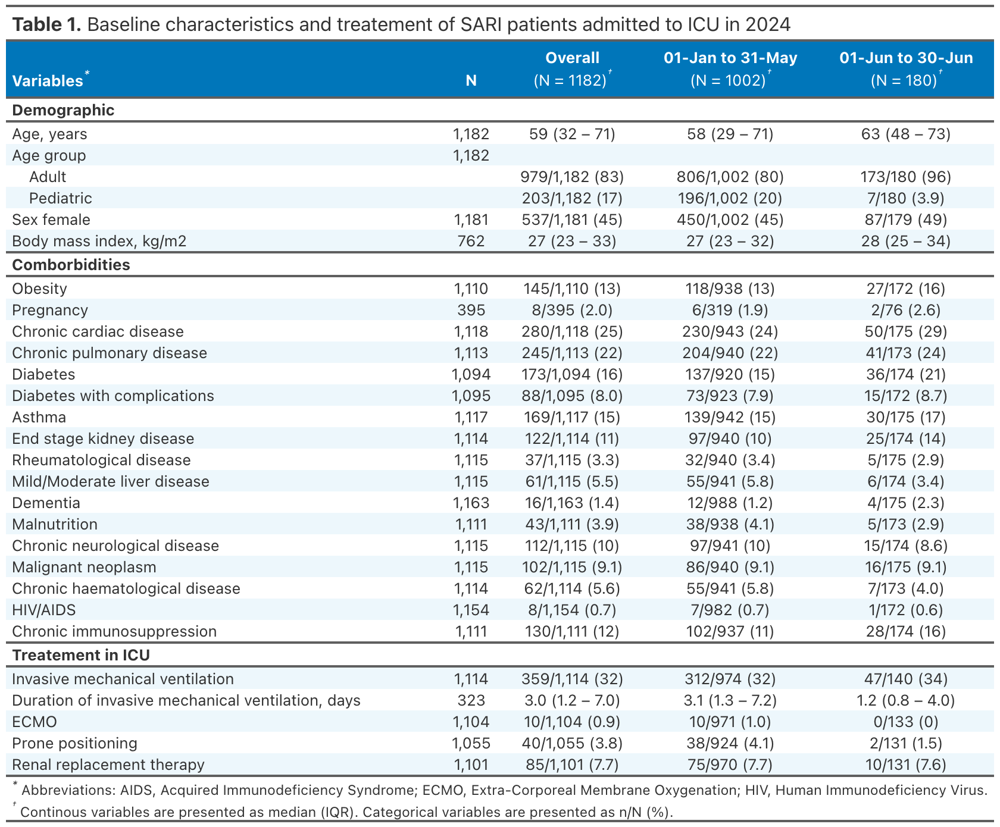
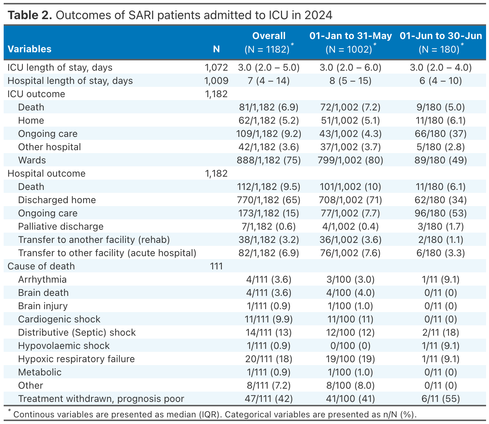
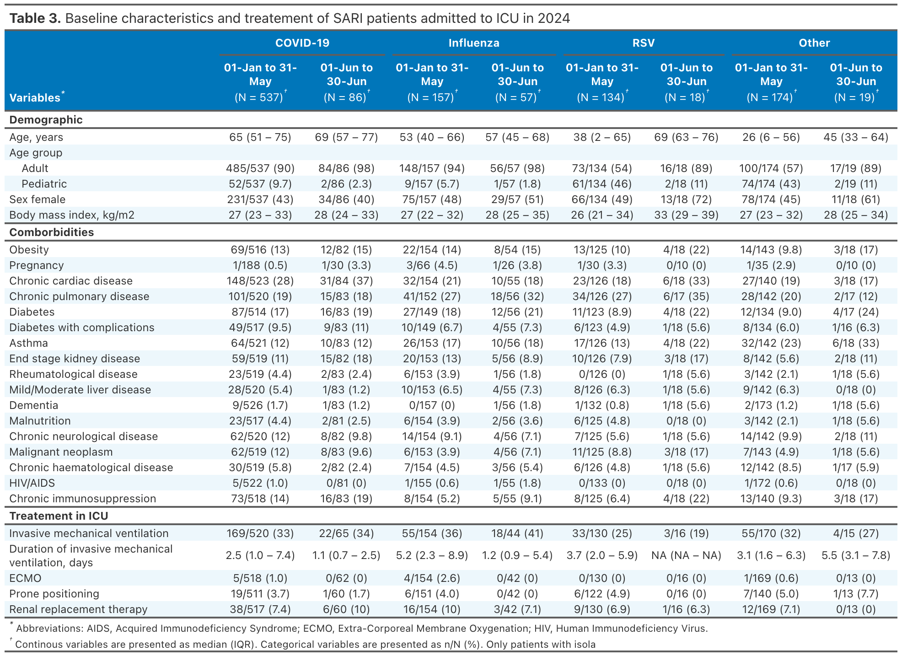
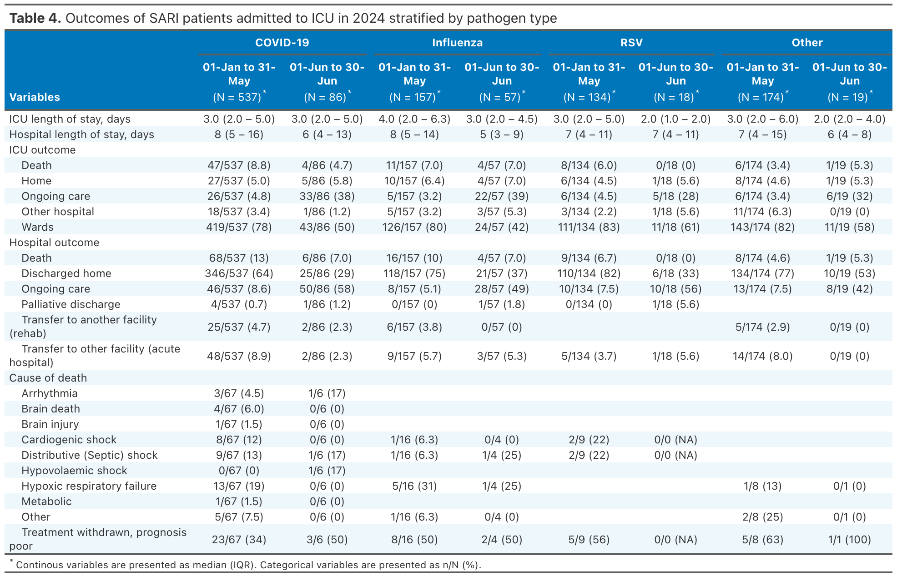

```{r, echo=FALSE}
knitr::opts_chunk$set(fig.path = paste0("plots/", Sys.Date(), "/"), 
                      fig.dpi = 900,
                      fig.width = 12, 
                      fig.height = 10,
                      dev = 'jpeg',
                      echo = FALSE, 
                      warning = FALSE, 
                      message = FALSE)
```


This report covers the period from 1^st^ June 2024 to 30^st^ June 2024.

# **Overall cohort**

```{r, echo=FALSE, message=FALSE, warning=FALSE}
library(dplyr)
library(tidyverse)

data_ssari <- readRDS("cleaned_data/2024-07-01_sprit_sari_annual_report_dataset.rds") %>% 
  mutate(month = format(hostdat_icu, "%m"), 
         year = format(hostdat_icu, "%Y"))

data_ssari_year <- data_ssari %>% 
  filter(year == "2024") %>%
  filter(month >= "01" & month <= "06")

data_ssari_month <- data_ssari %>% 
  filter(year == "2024") %>%
  filter(month == "06")

data_baseline_year <- data_ssari_year %>%
  group_by(subjid) %>%
  slice(1) %>%
  ungroup() %>%
  mutate(hosp_los = round(as.numeric(difftime(dsstdtc, hostdat, units = "days"))), 
         icu_los = round(as.numeric(difftime(dsstdtc_icudate, hostdat_icu, units = "days"))))


data_baseline_month <- data_ssari_month %>%
  group_by(subjid) %>%
  slice(1) %>%
  ungroup() %>%
  mutate(hosp_los = round(as.numeric(difftime(dsstdtc, hostdat, units = "days"))), 
         icu_los = round(as.numeric(difftime(dsstdtc_icudate, hostdat_icu, units = "days"))))
```

During the study period (1^st^ June 2024 to 30^th^ June 2024), there were **`r nrow(data_baseline_month)`** SARI patients admitted to the a participating SPRINT-SARI ICU. The cumulative number of patients in the SPRINT-SARI recorded for the year 2024 (1^st^ January to 30^th^ June) is now **`r nrow(data_baseline_year)`**. The weekly number of SARI admissions aggregated by  calendar month is shown in the **Figure 1**. Baseline characteristics of these patients are summarised in the **Table 1**. 

\

Figure 1. Weekly SARI admissions

\
```{r echo=FALSE, fig.height=8, fig.width=10, message=FALSE, warning=FALSE}
library(ggpubr)
data_count <- data_baseline_year %>% 
  mutate(icu_admission_week = as.numeric(round(difftime(hostdat_icu, "2024-01-01 00:00:00", units = "weeks"), 1)) + .5) %>%
  group_by(month) %>%
  summarise(n_month = n(), 
            icu_admission_week = icu_admission_week) %>%
  group_by(icu_admission_week) %>%
  summarise(n = n(), 
            n_month = n_month,
            month = month) %>%
  distinct() %>% 
  group_by(month) %>%
  mutate(icu_admission_week = round(icu_admission_week)) %>% 
  group_by(icu_admission_week, month) %>%
  summarise(n_month = n_month,
            n = sum(n)) %>% 
  distinct()

count <- data_count %>% select(month, n_month) %>% pull(n_month) %>% unique()
bars <- data_count %>% select(month, icu_admission_week) %>% group_by(month) %>% summarise(n_bars = max(icu_admission_week)) %>% mutate(position = n_bars / 2) %>% mutate(position = position + lag(position))

data_count %>%
  ggplot(aes(x = icu_admission_week, y = n, fill = month)) +
  geom_bar(stat = "identity", position = position_dodge()) +
  scale_fill_viridis_d(option = "viridis", direction = 1, labels = c("01" = "Jan", "02" = "Feb", "03" = "Mar", "04" = "Apr", "05" = "May", "06" = "Jun")) +
  annotate("rect", xmin = 0.5, xmax = bars$n_bars[1], ymin = 0, ymax = count[1], fill = "#440154", alpha = 0.2) +
  annotate("rect", xmin = bars$n_bars[1], xmax = bars$n_bars[2], ymin = 0, ymax = count[2], fill = "#414487", alpha = 0.2) +
  annotate("rect", xmin = bars$n_bars[2], xmax = bars$n_bars[3], ymin = 0, ymax = count[3], fill = "#2a788e", alpha = 0.2) +
  annotate("rect", xmin = bars$n_bars[3], xmax = bars$n_bars[4], ymin = 0, ymax = count[4], fill = "#22a884", alpha = 0.2) +
  annotate("rect", xmin = bars$n_bars[4], xmax = bars$n_bars[5], ymin = 0, ymax = count[5], fill = "#7ad151", alpha = 0.2) +
  annotate("rect", xmin = bars$n_bars[5], xmax = bars$n_bars[6], ymin = 0, ymax = count[6], fill = "#fde725", alpha = 0.2) +
  annotate("text", x = 2.5, y = count[1], label = paste("n =", count[1]) , color = "#440154", vjust = -.5) +
  annotate("text", x = bars$position[2], y = count[2], label = paste("n =", count[2]), color = "#414487", vjust = -.5) +
  annotate("text", x = bars$position[3], y = count[3], label = paste("n =", count[3]), color = "#2a788e", vjust = -.5) +
  annotate("text", x = bars$position[4], y = count[4], label = paste("n =", count[4]), color = "#22a884", vjust = -.5) +
  annotate("text", x = bars$position[5], y = count[5], label = paste("n =", count[5]), color = "#7ad151", vjust = -.5) +
  annotate("text", x = bars$position[6], y = count[6], label = paste("n =", count[6]), color = "#fde725", vjust = -.5) +
  theme_pubclean() + 
  scale_x_continuous(breaks = data_count %>% pull(icu_admission_week)) +
  ylab("Number of SARI cases") +
  xlab("Calendar week of ICU admission") +
  theme(legend.position = "right", legend.title = element_blank()) 
```

\
\

```{r, echo=FALSE, message=FALSE, warning=FALSE}
library(gtsummary)
library(gt)

reset_gtsummary_theme()
theme_gtsummary_journal(journal = 'nejm')
theme_gtsummary_compact()

data_baseline_year %>%
  mutate(period = ifelse(month < "06", "01-Jan to 31-May", "01-Jun to 30-Jun")) %>%
  mutate(chronic_liv_mhyn = case_when(mildliv_mhyn == 1 | modliver_mhyn == 1 ~ 1,
                                      is.na(mildliv_mhyn) & is.na(modliver_mhyn) ~ NA,
                                      .default = 0)) %>% 
  mutate(adult = ifelse(age_estimateyears >= 18, "Adult", "Pediatric")) %>%
  select(age_estimateyears, 
         adult,
         sex, 
         bmi_calc, 
         obesity_mhyn,
         pregyn_rptestcd,
         chroniccard_mhyn,
         obesity_mhyn,
         chronicpul_mhyn,
         diabetes_mhyn,
         diabetiscomp_mhyn,
         asthma_mhyn,
         renal_mhyn,
         rheumatology_mhyr,
         chronic_liv_mhyn,
         dementia_mhyn,
         malnutrition_mhyn,
         chronicneu_mhyn,
         malignantneo_mhyn,
         chronhaemo_mhyn,
         aidshiv_mhyn,
         chrimm_mhyn,
         imv_1,
         dura_vm1_reportonly,
         ecmo1,
         prone_pos,
         dialysis,
         period
  ) %>% 
  tbl_summary(by = period, 
              missing = "no",
              statistic = list(all_categorical() ~ "{n}/{N} ({p})"),
              label = list(age_estimateyears ~ "Age, years", 
                           adult ~ "Age group",
                           sex ~ "Sex female", 
                           bmi_calc ~ "Body mass index, kg/m2",
                           obesity_mhyn ~ "Obesity",
                           pregyn_rptestcd ~ "Pregnancy",
                           chroniccard_mhyn ~ "Chronic cardiac disease",
                           chronicpul_mhyn ~ "Chronic pulmonary disease",
                           diabetiscomp_mhyn ~ "Diabetes with complications",
                           diabetes_mhyn ~ "Diabetes",
                           asthma_mhyn ~ "Asthma",
                           renal_mhyn ~ "End stage kidney disease",
                           rheumatology_mhyr ~ "Rheumatological disease",
                           chronic_liv_mhyn ~ "Mild/Moderate liver disease",
                           dementia_mhyn ~ "Dementia",
                           malnutrition_mhyn ~ "Malnutrition",
                           chronicneu_mhyn ~ "Chronic neurological disease",
                           malignantneo_mhyn ~ "Malignant neoplasm",
                           chronhaemo_mhyn ~ "Chronic haematological disease",
                           aidshiv_mhyn ~ "HIV/AIDS",
                           chrimm_mhyn ~ "Chronic immunosuppression",
                           imv_1 ~ "Invasive mechanical ventilation",
                           ecmo1 ~ "ECMO",
                           prone_pos ~ "Prone positioning",
                           dialysis ~ "Renal replacement therapy", 
                           dura_vm1_reportonly ~ "Duration of invasive mechanical ventilation, days"),
              value = list(sex ~ 2)
  ) %>% 
  add_overall() %>%
  add_n() %>%
  modify_header(all_stat_cols() ~ md("**{level}**
    
                                       (N = {n})"),
                label = "**Variables**") %>% 
  modify_footnote(list(label ~ "Abbreviations: AIDS, Acquired Immunodeficiency Syndrome; ECMO, Extra-Corporeal Membrane Oxygenation; HIV, Human Immunodeficiency Virus."), 
                  all_stat_cols() ~ "Continous variables are presented as median (IQR). Categorical variables are presented as n/N (%).") %>%   
  as_gt() %>% 
  tab_row_group(group = "Treatement in ICU", rows = 24:28) %>%
  tab_row_group(group = "Comborbidities", rows = 7:23) %>%
  tab_row_group(group = "Demographic", rows = 1:6) %>%
  tab_style(style = list(cell_text(weight = "bold")),
            locations = cells_group()) %>%
  opt_stylize(style = 6, color = "blue", add_row_striping = TRUE) %>% 
  tab_header(title = md("**Table 1.** Baseline characteristics and treatement of SARI patients admitted to ICU in 2024")) %>%
  opt_align_table_header(align = "left") %>%
  opt_footnote_marks(marks = "extended") %>%
  gtsave("tables/table_1.png")
```

```{r, echo=FALSE, message=FALSE, warning=FALSE, out.width="100%"}

```


\
\

During the current study period 9/180 (5%) patients died in hospital, 89/180 (49%) were discharged to wards and 66/180 (37%) were still in hospital. The leading cause of death was treatment withdrawal 6/11 (55%). The median length of stay in ICU and in hospital was 3 (2-4) and 6 (4-10) days, respectively. The outcomes of these patients are summarised in the **Table 2**.

```{r echo=FALSE, message=FALSE, warning=FALSE}
data_baseline_year %>%
  mutate(corona_ieorres = ifelse(is.na(corona_ieorres), 0, corona_ieorres)) %>% 
  mutate(corona_ieorres = ifelse(corona_ieorres == 1, "COVID-19", "Non-COVID-19")) %>%
  mutate(period = ifelse(month < "06", "01-Jan to 31-May", "01-Jun to 30-Jun")) %>%
  mutate(dsterm = ifelse(dsterm == "Unknown", NA, dsterm)) %>%
  mutate(dsterm = ifelse(is.na(dsterm), "Ongoing care", dsterm)) %>%
  mutate(dsterm_2 = ifelse(is.na(dsterm_2), "Ongoing care", dsterm_2)) %>%
  select(
    icu_los,
    hosp_los,
    dsterm_2,
    dsterm,
    outcm_cod,
    period
  ) %>% 
  tbl_summary(by = period, 
              missing = "no",
              statistic = list(all_categorical() ~ "{n}/{N} ({p})"),
              label = list(icu_los ~ "ICU length of stay, days", 
                           hosp_los ~ "Hospital length of stay, days",
                           dsterm_2 ~ "ICU outcome",
                           dsterm ~ "Hospital outcome",
                           outcm_cod ~ "Cause of death")) %>% 
  add_overall() %>%
  add_n() %>%
  modify_header(all_stat_cols() ~ md("**{level}**
    
                                       (N = {n})"),
                label = "**Variables**") %>%
  modify_footnote(list(all_stat_cols() ~ "Continous variables are presented as median (IQR). Categorical variables are presented as n/N (%).")) %>%   
  as_gt() %>% 
  opt_stylize(style = 6, color = "blue", add_row_striping = TRUE) %>% 
  opt_footnote_marks(marks = "extended") %>%
  tab_header(title = md("**Table 2.** Outcomes of SARI patients admitted to ICU in 2024")) %>%
  opt_align_table_header(align = "left") %>%
  gtsave("tables/table_2.png")
```

```{r, echo=FALSE, message=FALSE, warning=FALSE, out.width="100%"}

```


\

# **Stratified by pathogen type**

Overall 32 patients presented a viral co-infection. Categorization was performed as follows : COVID-19 > Influenza > RSV > Other. Baseline characteristics, intervention, and outcomes according to the pathogen type are presented in **Table 3** and **Table 4**. Weekly SARI admissions according to the pathogen type are displayed in **Figure 2**. A heatmap summarising all co-infection is displayed in **Figure 3**

\
Figure 2. Weekly SARI admissions according to the pathogen type
```{r echo=FALSE, fig.height=14, fig.width=10, message=FALSE, warning=FALSE}
library(survminer)

pathogen_data <- data_baseline_year %>%
  mutate(if_other_please_specify = tolower(if_other_please_specify)) %>%
  mutate(corona_ieorres = ifelse(grepl("covid", if_other_please_specify) | grepl("coronavirus", if_other_please_specify), 1, corona_ieorres),
         haemophilus = ifelse(grepl("haemophilus", if_other_please_specify), 1, 0),
         noncovid___1 = ifelse(grepl("influenza", if_other_please_specify), 1, noncovid___1),
         noncovid___2 = ifelse(grepl("flu", if_other_please_specify), 1, noncovid___2),
         noncovid___3 = ifelse(grepl("rsv", if_other_please_specify), 1, noncovid___3),
         noncovid___4 = ifelse(grepl("parainfluenza", if_other_please_specify), 1, noncovid___4),
         adenovirus = ifelse(grepl("adeno", if_other_please_specify), 1, 0),
         metapneumovirus = ifelse(grepl("metapneumovirus", if_other_please_specify) | 
                                    grepl("hmpv", if_other_please_specify)
                                  , 1, 0),
         entero_rhinovirus = ifelse(grepl("rhino", if_other_please_specify) | grepl("entero", if_other_please_specify), 1, 0),
         mycoplasma = ifelse(grepl("mycoplasma", if_other_please_specify), 1, 0),
  ) %>% 
  group_by(subjid) %>%
  mutate(noncovid___1 = ifelse(noncovid___1 == 1, 1, noncovid___2)) %>%
  mutate(inf_sum = sum(corona_ieorres, noncovid___1, noncovid___3, noncovid___4, adenovirus, metapneumovirus, entero_rhinovirus, mycoplasma, na.rm = TRUE)) %>% 
  ungroup()

pathogen_data <- pathogen_data %>% 
  mutate(pathogen = case_when(corona_ieorres == 1 ~ "COVID-19",
                              noncovid___1 == 1 ~ "Influenza", 
                              noncovid___2 == 1 ~ "Influenza",
                              noncovid___3 == 1 ~ "Respiratory syncytial virus",
                              noncovid___4 == 1 ~ "Parainfluenza",
                              adenovirus == 1 ~ "Adenovirus",
                              metapneumovirus == 1 ~ "Metapneumovirus",
                              entero_rhinovirus == 1 ~ "Entero/Rhinovirus",
                              haemophilus == 1 ~ "Other",
                              mycoplasma == 1 ~ "Other",
                              .default = "Other")) %>% 
  mutate(pathogen_short = case_when(pathogen == "COVID-19" ~ "COVID-19",
                                    pathogen == "Influenza" ~ "Influenza",
                                    pathogen == "Respiratory syncytial virus" ~ "RSV",
                                    .default = "Other")) %>%  
  mutate(pathogen_short = factor(pathogen_short, levels = c("COVID-19", "Influenza", "RSV", "Other")))

data_count <- pathogen_data %>%
  mutate(icu_admission_week = as.numeric(round(difftime(hostdat_icu, "2024-01-01 00:00:00", units = "weeks"), 1)) + .5) %>%  
  group_by(icu_admission_week, pathogen_short) %>%
  summarise(n = n(), 
            month = format(hostdat_icu, "%m")) %>%
  distinct() %>% 
  group_by(month, pathogen_short) %>%
  mutate(n_month = sum(n), 
         icu_admission_week = round(icu_admission_week)) %>% 
  group_by(icu_admission_week, month, pathogen_short) %>%
  summarise(n_month = n_month,
            n = sum(n)) %>% 
  distinct()

image <- data_count %>%
  ggplot(aes(x = icu_admission_week, y = n, fill = month)) +
  geom_bar(stat = "identity", position = position_dodge()) +
  scale_fill_viridis_d(option = "viridis", direction = 1, labels = c("01" = "Jan", "02" = "Feb", "03" = "Mar", "04" = "Apr", "05" = "May", "06" = "Jun")) +
  facet_wrap(~pathogen_short, ncol = 1) +
  theme_pubclean() + 
  scale_x_continuous(breaks = data_count %>% pull(icu_admission_week)) +
  ylab("Number of SARI cases") +
  xlab("Calendar week of ICU admission") +
  theme(legend.position = "right", legend.title = element_blank()) + 
  theme(strip.background = element_rect(fill = "#1A5276"), strip.text = element_text(color = "white"))

table <- ggsummarytable(data_count %>% mutate("Monthly number" = n_month), x = "month", y = "Monthly number", color = "month", facet.by = "pathogen_short", ncol = 1) + 
  theme_cleantable() +
  ylab("") + 
  xlab("Month") +
  scale_color_viridis_d(option = "viridis", direction = 1, labels = c("COVID-19" = "COVID-19", "Influenza" = "Influenza", "RSV" = "RSV", "Other" = "Other")) + 
  theme(strip.background = element_rect(fill = "#1A5276"), strip.text = element_text(color = "white"))

ggarrange(image, table, ncol = 1, common.legend = TRUE, align = "hv", heights = c(9, 3), legend = "right")
```

Figure 3. Heatmap of patients with viral co-infections

\
```{r}
# library(d3heatmap)
# library(RColorBrewer)
# 
# pathogen_data %>% 
#   filter(inf_sum > 1) %>% select(corona_ieorres, noncovid___1, noncovid___3, noncovid___4, adenovirus, metapneumovirus, entero_rhinovirus, mycoplasma) %>% mutate(corona_ieorres = ifelse(is.na(corona_ieorres), 0, corona_ieorres)) %>% 
#   as.matrix() %>%
#   d3heatmap(col = c("#D4E6F1", "#5499C7"), dendrogram = "none", key = TRUE, scale = 'none')

library(pheatmap)
pathogen_data %>%
  filter(inf_sum > 1) %>% 
  select(corona_ieorres, noncovid___1, noncovid___3, noncovid___4, adenovirus, metapneumovirus, entero_rhinovirus, mycoplasma, haemophilus) %>% 
  mutate(corona_ieorres = ifelse(is.na(corona_ieorres), 0, corona_ieorres)) %>%
  rename("COVID-19" = corona_ieorres, 
         "Influenza" = noncovid___1, 
         "Respiratory syncytial virus" = noncovid___3, 
         "Parainfluenza" = noncovid___4,
         "Adenovirus" = adenovirus,
         "Metapneumovirus" = metapneumovirus,
         "Entero/Rhinovirus" = entero_rhinovirus,
         "Haemophilus" = haemophilus,
         "Mycoplasma" = mycoplasma) %>%
  as.matrix() %>%
  pheatmap(treeheight_row = 0, treeheight_col = 0, color = c("#D4E6F1", "#5499C7"), legend = FALSE, labels_row = c(1:32)) 

```
Each row represents a patient. Dark blue cells indicate a positive infection
\
\

```{r echo=FALSE, message=FALSE, warning=FALSE, paged.print=TRUE}
pathogen_data %>%
  mutate(corona_ieorres = ifelse(is.na(corona_ieorres), 0, corona_ieorres)) %>% 
  mutate(corona_ieorres = ifelse(corona_ieorres == 1, "COVID-19", "Non-COVID-19")) %>%
  mutate(period = ifelse(month < "06", "01-Jan to 31-May", "01-Jun to 30-Jun")) %>%
  mutate(chronic_liv_mhyn = case_when(mildliv_mhyn == 1 | modliver_mhyn == 1 ~ 1,
                                      is.na(mildliv_mhyn) & is.na(modliver_mhyn) ~ NA,
                                      .default = 0)) %>% 
  mutate(adult = ifelse(age_estimateyears >= 18, "Adult", "Pediatric")) %>%
  select(age_estimateyears, 
         adult,
         sex, 
         bmi_calc, 
         obesity_mhyn,
         pregyn_rptestcd,
         chroniccard_mhyn,
         obesity_mhyn,
         chronicpul_mhyn,
         diabetes_mhyn,
         diabetiscomp_mhyn,
         asthma_mhyn,
         renal_mhyn,
         rheumatology_mhyr,
         chronic_liv_mhyn,
         dementia_mhyn,
         malnutrition_mhyn,
         chronicneu_mhyn,
         malignantneo_mhyn,
         chronhaemo_mhyn,
         aidshiv_mhyn,
         chrimm_mhyn,
         imv_1,
         dura_vm1_reportonly,
         ecmo1,
         prone_pos,
         dialysis,
         period,
         pathogen_short
  ) %>% 
  tbl_strata(strata = pathogen_short, 
             .tbl_fun = ~.x %>% tbl_summary(by = period, 
                                            missing = "no",
                                            statistic = list(all_categorical() ~ "{n}/{N} ({p})"),
                                            label = list(age_estimateyears ~ "Age, years", 
                                                         adult ~ "Age group",
                                                         sex ~ "Sex female", 
                                                         bmi_calc ~ "Body mass index, kg/m2",
                                                         obesity_mhyn ~ "Obesity",
                                                         pregyn_rptestcd ~ "Pregnancy",
                                                         chroniccard_mhyn ~ "Chronic cardiac disease",
                                                         chronicpul_mhyn ~ "Chronic pulmonary disease",
                                                         diabetiscomp_mhyn ~ "Diabetes with complications",
                                                         diabetes_mhyn ~ "Diabetes",
                                                         asthma_mhyn ~ "Asthma",
                                                         renal_mhyn ~ "End stage kidney disease",
                                                         rheumatology_mhyr ~ "Rheumatological disease",
                                                         chronic_liv_mhyn ~ "Mild/Moderate liver disease",
                                                         dementia_mhyn ~ "Dementia",
                                                         malnutrition_mhyn ~ "Malnutrition",
                                                         chronicneu_mhyn ~ "Chronic neurological disease",
                                                         malignantneo_mhyn ~ "Malignant neoplasm",
                                                         chronhaemo_mhyn ~ "Chronic haematological disease",
                                                         aidshiv_mhyn ~ "HIV/AIDS",
                                                         chrimm_mhyn ~ "Chronic immunosuppression",
                                                         imv_1 ~ "Invasive mechanical ventilation",
                                                         ecmo1 ~ "ECMO",
                                                         prone_pos ~ "Prone positioning",
                                                         dialysis ~ "Renal replacement therapy", 
                                                         dura_vm1_reportonly ~ "Duration of invasive mechanical ventilation, days"),
                                            value = list(sex ~ 2)
             ) %>% 
               modify_header(all_stat_cols() ~ md("**{level}**
                                  
                                                                     (N = {n})"),
                             label = "**Variables**") %>% 
               modify_footnote(list(label ~ "Abbreviations: AIDS, Acquired Immunodeficiency Syndrome; ECMO, Extra-Corporeal Membrane Oxygenation; HIV, Human Immunodeficiency Virus."), 
                               all_stat_cols() ~ "Continous variables are presented as median (IQR). Categorical variables are presented as n/N (%). Only patients with isola")) %>%   
  as_gt() %>% 
  tab_row_group(group = "Treatement in ICU", rows = 24:28) %>%
  tab_row_group(group = "Comborbidities", rows = 7:23) %>%
  tab_row_group(group = "Demographic", rows = 1:6) %>%
  tab_style(style = list(cell_text(weight = "bold")),
            locations = cells_group()) %>%
  opt_stylize(style = 6, color = "blue", add_row_striping = TRUE) %>% 
  tab_header(title = md("**Table 3.** Baseline characteristics and treatement of SARI patients admitted to ICU in 2024")) %>%
  opt_align_table_header(align = "left") %>%
  opt_footnote_marks(marks = "extended") %>%
  tab_options(table.font.size = 12) %>%
  gtsave("tables/table_3.png")
```

```{r, echo=FALSE, message=FALSE, warning=FALSE, out.width="100%"}

```


\
\

```{r echo=FALSE, message=FALSE, warning=FALSE, paged.print=TRUE}
pathogen_data %>%
  mutate(corona_ieorres = ifelse(is.na(corona_ieorres), 0, corona_ieorres)) %>% 
  mutate(corona_ieorres = ifelse(corona_ieorres == 1, "COVID-19", "Non-COVID-19")) %>%
  mutate(period = ifelse(month < "06", "01-Jan to 31-May", "01-Jun to 30-Jun")) %>%
  mutate(dsterm = ifelse(dsterm == "Unknown", NA, dsterm)) %>%
  mutate(dsterm = ifelse(is.na(dsterm), "Ongoing care", dsterm)) %>%
  mutate(dsterm_2 = ifelse(is.na(dsterm_2), "Ongoing care", dsterm_2)) %>%
  select(
    icu_los,
    hosp_los,
    dsterm_2,
    dsterm,
    outcm_cod,
    period,
    pathogen_short
  ) %>% 
  tbl_strata(strata = pathogen_short, 
             .tbl_fun = ~.x %>% tbl_summary(by = period, 
                                            missing = "no",
                                            statistic = list(all_categorical() ~ "{n}/{N} ({p})"),
                                            label = list(icu_los ~ "ICU length of stay, days", 
                                                         hosp_los ~ "Hospital length of stay, days",
                                                         dsterm_2 ~ "ICU outcome",
                                                         dsterm ~ "Hospital outcome",
                                                         outcm_cod ~ "Cause of death")) %>% 
               modify_header(all_stat_cols() ~ md("**{level}**
                                  
                                                                     (N = {n})"),
                             label = "**Variables**") %>%
               modify_footnote(list(all_stat_cols() ~ "Continous variables are presented as median (IQR). Categorical variables are presented as n/N (%)."))) %>%   
  as_gt() %>% 
  opt_stylize(style = 6, color = "blue", add_row_striping = TRUE) %>% 
  opt_footnote_marks(marks = "extended") %>%
  tab_header(title = md("**Table 4.** Outcomes of SARI patients admitted to ICU in 2024 stratified by pathogen type")) %>%
  opt_align_table_header(align = "left") %>%
  tab_options(table.font.size = 12) %>%
  gtsave("tables/table_4.png")
```

```{r, echo=FALSE, message=FALSE, warning=FALSE, out.width="100%"}

```
