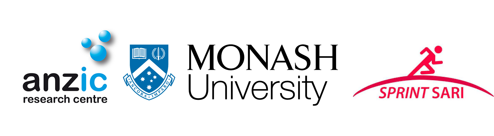

{width="100%"}

SPRINT-SARI international is an ambitious collaborative project aimed at characterizing Severe Acute Respiratory Infection (SARI) patients to better inform management strategies and ultimately to improve the ability of health care systems to rapidly respond to emerging SARI infections.

\
SPRINT-SARI Australia was mobilised rapidly in March 2020 to capture Coronavirus Disease (COVID-19) patients. It is a multi-centre, prospective, short period incidence observational study of patients in participating Intensive Care Units (ICU) with SARI. Initially, patients were entered into the SPRINT-SARI database if they were COVID-19 positive on Polymerase Chain Reaction (PCR) or Rapid Antigen Test (RAT), or suspected of being positive at the time of the report. However, after July 01, 2020, patients were only entered if they were PCR or RAT positive. From June 01 2022, non COVID SARI cases were also included. Non COVID SARI were defined as having both a primary admission to ICU for the management of acute respiratory failure or a complication and positive PCR for the following viral pathogens:

-   Influenza A or B

-   Parainfluenza

-   Respiratory syncytial virus (RSV)\
    \

In 2022, the Case Report Form (CRF) transitioned into a minimum dataset CRF (version 4.5) to help alleviate the data burden experienced by sites during the ongoing COVID-19 pandemic. This CRF comprises of five main data collection components as follows:

1.  Inclusion Criteria (PCR results and vaccination status)

2.  Demographics (Ethnic group, age, sex, Body Mass Index (BMI), hospital and ICU admission dates and co morbidities)

3.  Infectious Respiratory Disease Pathogen Testing and Diagnosis (PCR results and variants)

4.  Respiratory Treatments and Hemodynamics (Invasive Mechanical Ventilation (IMV), Extra-Corporeal Membrane Oxygenation (ECMO), Renal Replacement Therapy (RRT) and prone positioning)

5.  Outcomes (Specific treatments, ICU and hospital discharge dates and patient outcomes)

```{r warning=TRUE, include=FALSE}
library(dplyr)

data_ssari <- readRDS("cleaned_data/sprit_sari_annual_report_2023_dataset.rds")

id_included <- data_ssari %>% select(subjid) %>% unique() %>% pull(subjid)
```

\

To date, there are over **`r length(id_included)`** patients included in the SPRINT-SARI Australia database. This data continue to be provided monthly to the Australian Government, to inform public heath response and enrich the current body of literature on SARI management in ICU (<https://pubmed.ncbi.nlm.nih.gov/?term=sprint-SARI>).

\

The success of SPRINT-SARI is only through the efforts of many people. We would like to thank all research coordinators and data collectors across Australia for providing this data and supporting SPRINT-SARI. We are also thankful to the SPRINT-SARI Management Committee for their valuable and ongoing contributions and time.
